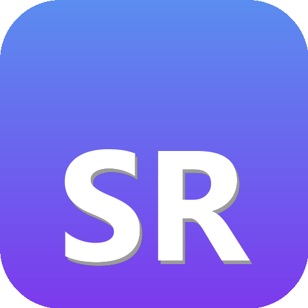
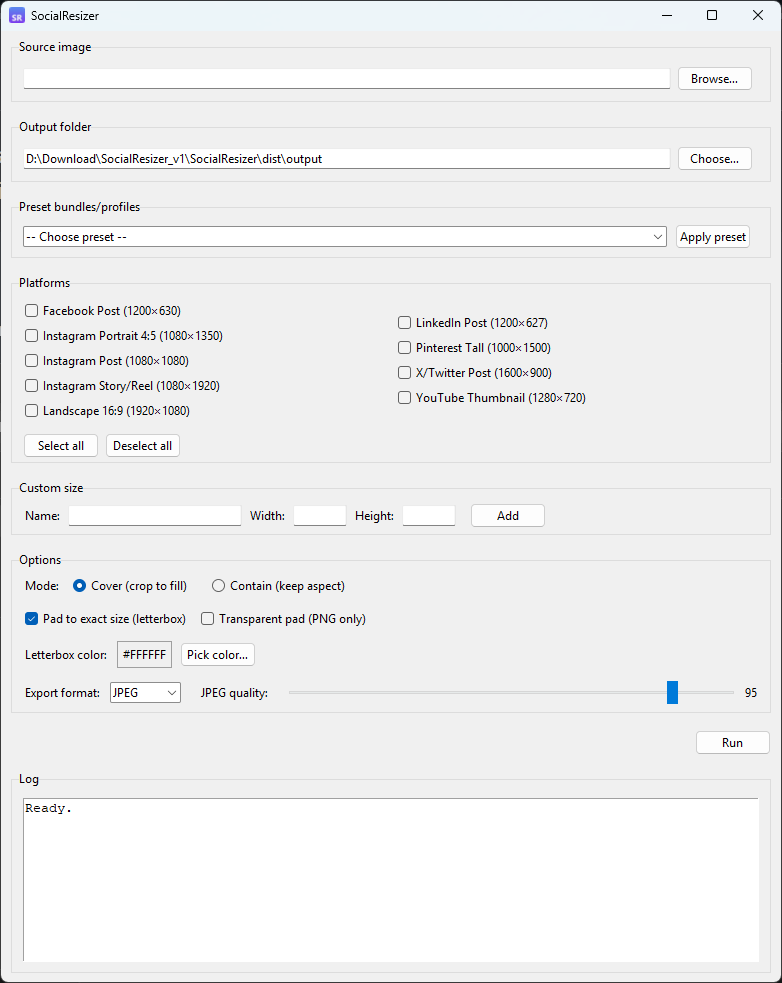

# SocialResizer · *One‑click, on‑spec, on‑brand.*

<p align="center">
  
</p>

<p align="center">
  <a href="#"></a>
  <a href="#"></a>
  <a href="#"></a>
  <a href="#"></a>
  <a href="#"></a>
</p>

> Batch‑create perfectly sized social images in seconds.  
> Presets for major platforms, custom sizes, **cover / contain** modes, **letterbox** (solid color or **transparent**), and export to **JPEG / PNG / Both**.

---

## Table of Contents

- [Why SocialResizer?](#-why-socialresizer)
- [Features](#-features)
- [Built‑in Sizes](#-built-in-sizes)
- [Install](#-install)
- [Usage](#-usage)
- [Build a Windows .exe](#-build-a-windows-exe)
- [FAQ](#-faq)
- [Troubleshooting](#-troubleshooting)
- [Roadmap](#-roadmap)
- [Contributing](#-contributing)
- [License](#-license)

---

## ✨ Why SocialResizer?

Producing on‑spec visuals for multiple platforms is slow and error‑prone: every network uses different aspect ratios, and manual cropping wastes time and consistency. **SocialResizer** turns one source image into a complete, platform‑ready set—**correct sizes, correct formats, consistent branding**—with a single run.

- **Save time:** One input → many outputs.  
- **Protect composition:** *Cover* to fill without awkward bars, or *Contain* to preserve the full image.  
- **Stay on brand:** Letterbox with your brand color or transparent padding for compositing.

---

## 🚀 Features

- **Preset bundles**: Instagram (All / Feed / Stories), LinkedIn, Facebook, X/Twitter, YouTube thumbnails, Ads profiles, and more.
- **Custom sizes**: Add your own name + width × height on the fly.
- **Two resize modes**:
  - **Cover** (crop to fill, perfect fit, no bars)
  - **Contain** (keep aspect; optional **letterbox** to exact size)
- **Letterbox options**:
  - Solid color (pick any hex)
  - **Transparent** (PNG only)
- **Export formats**: **JPEG**, **PNG**, or **Both** (progressive JPEGs).
- **Safe filenames**: Avoids Windows reserved names (e.g., `PRN`, `CON`, …).
- **Clean, single‑file GUI** (Tkinter).

> **100% local.** No telemetry, no network calls, no data leaves your machine.

---

## 🧭 Built‑in Sizes

| Label | Pixels |
|---|---|
| Instagram Post | 1080 × 1080 |
| Instagram Portrait (4:5) | 1080 × 1350 |
| Instagram Story / Reel | 1080 × 1920 |
| Facebook Post | 1200 × 630 |
| LinkedIn Post | 1200 × 627 |
| X/Twitter Post | 1600 × 900 |
| YouTube Thumbnail | 1280 × 720 |
| Landscape 16:9 | 1920 × 1080 |
| Pinterest Tall | 1000 × 1500 |

You can add more in the `SIZES` dictionary or create ad‑hoc **Custom size** entries in the app.

---

## 📦 Install

**Requirements**
- Python 3.8+  
- Pillow (`pip install pillow`)  
- Tkinter (preinstalled on Windows/macOS; on some Linux distros: `sudo apt install python3-tk`)

```bash
# Clone or download this repo, then:
pip install pillow
# Linux may also need:
# sudo apt install python3-tk

# Run the app
python social_resizer_gui.py
```

---

## 🖱️ Usage

1. **Source image** → *Browse…* and pick your file (`.jpg`, `.png`, `.webp`, `.tiff`, …).  
2. **Output folder** → choose where to save results.  
3. **Preset bundles** → pick one (e.g., *Instagram – All*) and click **Apply preset**.  
4. **Platforms** → (de)select individual sizes or add a **Custom size**.  
5. **Mode**:
   - **Cover**: crops overflow to **fill** the target size exactly.
   - **Contain**: keeps the full image; optionally **Pad to exact size (letterbox)**.
6. **Letterbox**:
   - Choose a **Letterbox color** (hex) **or** **Transparent pad** (PNG only).
7. **Export**: choose **JPEG / PNG / Both** and set **JPEG quality**.  
8. Click **Run**. Check the **Log** pane and your output folder.

---

## 🏗️ Build a Windows .exe

Generate the branded icon first (optional):
```bash
python assets/make_icon.py
```

**PowerShell (one line):**
```powershell
python -m PyInstaller --onefile --noconsole --name SocialResizer --add-data "assets/social_resizer.ico;assets" --icon "assets/social_resizer.ico" social_resizer_gui.py
```

**cmd.exe (multi‑line):**
```cmd
python -m PyInstaller --onefile --noconsole --name SocialResizer ^
  --add-data "assets\social_resizer.ico;assets" ^
  --icon assets\social_resizer.ico social_resizer_gui.py
```

**macOS / Linux** (note the colon in `--add-data`):
```bash
python -m PyInstaller --onefile --noconsole --name SocialResizer   --add-data "assets/social_resizer.ico:assets"   --icon assets/social_resizer.ico social_resizer_gui.py
```

> Prefer `python -m PyInstaller` to ensure the PyInstaller used is from the same environment as Pillow.

---

## ❓ FAQ

**Q: Cover vs Contain?**  
**Cover** crops overflow to fill the target area exactly—no letterbox bars.  
**Contain** keeps the entire image; optionally pad to exact size with a solid color or transparent background (PNG).

**Q: Transparent letterbox + JPEG?**  
JPEG does not support alpha. If you export JPEG with transparent padding selected, the letterbox **color** is used for the JPEG, while PNG keeps transparency.

**Q: Where are outputs saved?**  
In the output folder you choose. Filenames are suffixed by the platform key (e.g., `_instagram_post`).

**Q: Can I add new presets?**  
Yes—edit the `PRESETS` dictionary to add or rename preset bundles (e.g., “Organic”, “Ads”, “Stories only”).

---

## 🧯 Troubleshooting

- **`Import "PIL" could not be resolved`**  
  Install Pillow in the same environment you run the app from:
  ```bash
  python -m pip install pillow
  ```
- **`Tkinter` missing on Linux**  
  ```bash
  sudo apt install python3-tk
  ```
- **PyInstaller command fails**  
  Use the syntax matching your shell (PowerShell vs cmd). See [Build a Windows .exe](#-build-a-windows-exe).
- **`Unable to initialize device PRN` on Windows**  
  Your file or folder name collides with a reserved device name (`PRN`, `CON`, `AUX`, `NUL`, `COM1`–`COM9`, `LPT1`–`LPT9`). Rename it; the app also guards against this.

---

## 🗺️ Roadmap

- Drag‑and‑drop images into the window  
- Batch over multiple source images  
- Filename prefixes per preset (e.g., `_ads`, `_organic`)  
- Preset import/export (JSON)

---

## 🤝 Contributing

PRs are welcome! Keep code comments **in English**, and try to match the current style (small, dependency‑light, platform‑agnostic). For new presets, include a brief note and references to official size specs if relevant.

---


---

## 📷 Screenshots

<p align="center">
  
</p>


## 📝 License

This project is licensed under the **MIT License** — see [`LICENSE`](LICENSE) for details.

© 2025 Daniel Gustafsson
